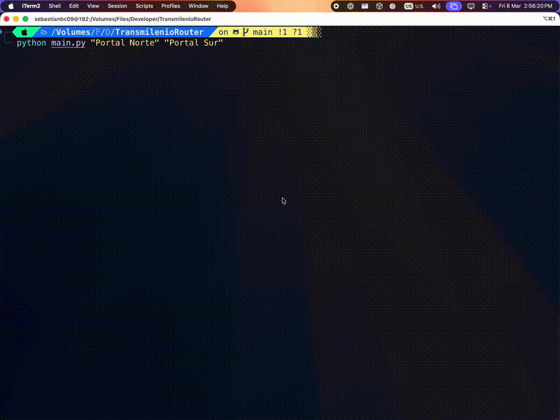
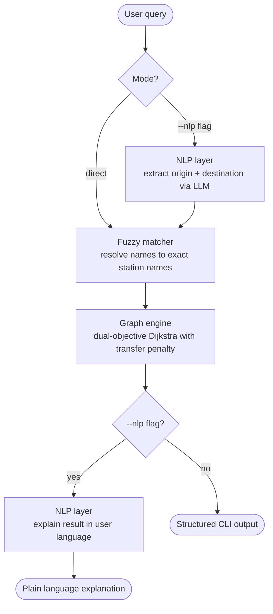

# Transmilenio Router

A graph-based routing engine for Bogota's Transmilenio BRT system, with a natural language interface powered by LLMs.

> **Current version: v2.0.0** - NLP layer with robust routing
> [View releases](https://github.com/YOUR_USERNAME/transmilenio-router/releases)

---

## Demo



---

## Problem

This project started as a personal frustration.

As a daily Transmilenio user, I kept running into the same problems with every routing app available, official or third-party. Routes that made no sense. Journeys that required four buses when two would do. Searches that returned no result at all. Load times that were longer than just figuring it out yourself.

The deeper issue is that most of these apps treat Transmilenio as a collection of individual bus routes: you pick a route, you follow it. But that is not how the system actually works. Transmilenio is a network. It is a graph - 141 stations as nodes, 89 routes creating edges between them, with free internal transfers at any shared station. The optimal path between two points is not about finding "the right bus", it is about finding the shortest traversal through that graph.

Once I saw it that way, the problem became a CS problem. And the existing tools were clearly not solving it that way.

The second frustration was the interface. Every app forces you through the same flow: tap origin, tap destination, scroll a map, hope autocomplete works. It is a bad experience for a city where people describe destinations by landmarks, neighborhood names, or partial station names. A natural language interface where you just ask *"como llego de Heroes a Usme?"* is both more natural and more resilient to the way people actually think about where they are going.

---

## Approach

Model the Transmilenio network as a directed graph where:

- **Nodes** are stations (141 total across 12 trunk lines)
- **Edges** connect consecutive stops within each route
- **Transfers** are handled naturally - any station serving multiple routes is automatically a transfer point
- **Routing** uses a dual-objective Dijkstra that minimizes both stops and transfers simultaneously

A natural language layer (LLM API) sits in front of the graph engine, parsing user queries in Spanish or English and explaining results in plain language.

---

## How It Works



---

## Technical Decisions

**Why Dijkstra over A\*?**
The Transmilenio graph has 141 nodes and 89 routes. At this scale, Dijkstra's O((V+E) log V) is fast enough that a heuristic offers no meaningful gain. A\* requires a spatial heuristic (geographic distance), which adds complexity without benefit here.

**Why dual-objective routing?**
A naive Dijkstra minimizing stop count alone finds paths with fewer stops but many unnecessary transfers. The engine runs Dijkstra with multiple transfer penalty values (1-5) and scores each candidate as `stops + (transfers x 2)`, picking the lowest score. This simultaneously minimizes both goals without hard-coding a preference for either.

**Why NetworkX over a custom implementation?**
v2 priority is correctness and data modeling, not performance. NetworkX is battle-tested, readable, and sufficient for this graph size.

**Why provider-agnostic LLM?**
The NLP layer uses an OpenAI-compatible client configured via `.env`. Swapping providers (Groq, Mistral, OpenAI) requires only a config change, no code changes.

**Scope: Transmilenio trunk system only (no SITP)**
SITP integration would make the routing problem significantly more complex. v2 proves the core model with a bounded, well-defined network.

---

## Data Source

Open data published by the Distrito de Bogota. The following were excluded from the model:

- **Routes excluded:** D81, K86, L81, L82, M82, M84, M85, M86, C84, P85, A61 - street-stop or feeder routes outside the trunk system
- **Stations excluded:** Tercer Milenio, Calle 19, Calle 26, AV. 39, Calle 63, Calle 72, Patio Bonito, SENA, Hospital - present in source data but not in any active trunk route

---

## Project Structure

```
transmilenio-router/
├── data/
│   ├── raw/                    # Original CSVs - never modify
│   └── processed/              # Cleaned data used by the app
│       ├── trunk_lines.csv
│       ├── stations.csv
│       └── routes.csv
├── docs/
│   └── demo.gif                # Demo recording (add your own - see Demo section)
├── notebooks/
│   └── 01_eda.ipynb            # Exploratory data analysis
├── src/
│   ├── __init__.py
│   ├── graph.py                # Graph construction from processed CSVs
│   ├── routing.py              # Dual-objective Dijkstra pathfinding
│   └── nlp.py                  # LLM interface layer
├── tests/
│   └── test_routing.py         # 14 pytest tests
├── main.py                     # CLI entry point
├── requirements.txt
├── pyproject.toml              # pytest + ruff + pyrefly config
├── .env.example                # Environment variable template
├── .gitignore
└── README.md
```

---

## Setup

```bash
git clone https://github.com/YOUR_USERNAME/transmilenio-router.git
cd transmilenio-router

# Create and activate virtual environment
python -m venv venv
source venv/bin/activate        # Windows: venv\Scripts\activate

# Install dependencies
pip install -r requirements.txt

# Configure environment
cp .env.example .env
# Edit .env with your LLM provider credentials - see Environment Variables below
```

---

## Environment Variables

Copy `.env.example` to `.env` and fill in the values. The app works without credentials in direct mode. `LLM_API_KEY` is only required for `--nlp` mode.

```bash
# Which LLM provider to use for natural language parsing and route explanation.
# Supported values: groq | mistral | openai
# Default: groq  (recommended - generous free tier, no credit card required)
LLM_PROVIDER=groq

# API key for the selected provider.
# Groq:    https://console.groq.com/keys       - free, 14,400 req/day
# Mistral: https://console.mistral.ai/api-keys - free, 1B tokens/month
# OpenAI:  https://platform.openai.com/api-keys
LLM_API_KEY=your_api_key_here

# Model to use for the selected provider.
# Groq recommended:    llama-3.3-70b-versatile
# Mistral recommended: mistral-small-latest
# OpenAI recommended:  gpt-4o-mini
LLM_MODEL=llama-3.3-70b-versatile
```

**Getting a free Groq API key (recommended for getting started):**
1. Go to [console.groq.com](https://console.groq.com)
2. Sign up - no credit card required
3. Go to **API Keys** -> **Create API Key**
4. Copy the key and paste it into `.env` as `LLM_API_KEY`

---

## Usage

### Direct mode - exact or fuzzy station names

```bash
python main.py "Portal Norte - Unicervantes" "Portal Sur - JFK Coop. Financiera"
```

Fuzzy matching is supported - partial names, lowercase, missing accents, and abbreviations all work:

```bash
python main.py "portal norte" "portal sur"
python main.py "Heroes" "Usme"
python main.py "Calle 106" "Portal Sur"
python main.py "AV Rojas" "Ciudad Universitaria"
```

### NLP mode - natural language queries

Requires `LLM_API_KEY` to be set in `.env`.

```bash
# Spanish
python main.py --nlp "Como llego de Heroes a Usme?"
python main.py --nlp "Como puedo llegar a AV Rojas desde Ciudad Universitaria?"

# English
python main.py --nlp "How do I get from Portal Norte to Portal Sur?"
python main.py --nlp "What's the best route from El Dorado to Calle 106?"
```

### Programmatic usage

```python
from src.graph import build_graph
from src.routing import find_route

G = build_graph()
result = find_route(G, "Heroes", "Portal Usme")

print(result.stops)        # Full stop sequence
print(result.routes_used)  # ['H27', 'H20']
print(result.transfers)    # ['Calle 40 Sur']
print(result.total_stops)  # 5
```

---

## Running Tests

```bash
pytest tests/ -v
```

14 tests covering graph construction, routing, fuzzy search, transfer detection, and edge cases.

---

## Graph Statistics

| Metric | Value |
|---|---|
| Stations (nodes) | 141 |
| Trunk lines | 12 |
| Routes (edge sets) | 89 |
| Weakly connected | Yes |
| Average stops per route | ~15 |

**Trunk lines:** A (Caracas), B (Autopista Norte), C (Suba), D (Calle 80), E (NQS Central), F (Americas), G (NQS Sur), H (Caracas Sur), J (Eje Ambiental), K (Calle 26), L (Carrera 10), M (Carrera 7)

---

## Roadmap

| Version | Description | Status |
|---|---|---|
| v1 | Static graph, stop-count weights, CLI | ✅ Released |
| v2 | NLP layer, fuzzy search, transfer penalty | ✅ Released |
| v3 | GTFS data, time-based weights, Appwrite | 🔜 In progress |
| v4 | Angular frontend, NestJS REST API | Planned |
| v5 | SITP integration, ML time profiles | Planned |

---

## What I Would Do Differently

- **Use GTFS from the start** - it provides stop sequences, schedules, and coordinates in a standardized schema. v3 migrates to this.
- **Model transfer penalties from day one** - the v1 naive Dijkstra produced routes with unnecessary transfers. The dual-objective scorer in v2 fixes this but required significant rework.
- **Add geographic coordinates to nodes earlier** - enables spatial queries and map visualization without a data pipeline refactor.
